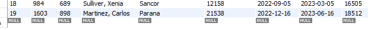

# insurance_policy_system
Developing a CRUD system with Spring Boot and MySQL to manipulate data about car insurance policies.

Get all policies:

MySql table:

Get by id:

Get by id not found:

Post new policy:

Update policy:

MySql table after update:

Delete policy by id:

Mysql table after delete:

